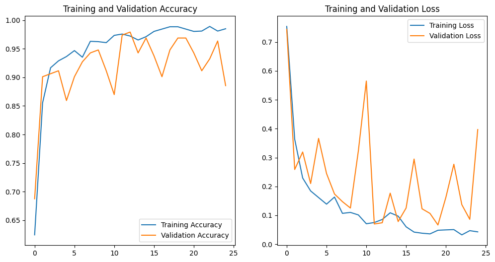
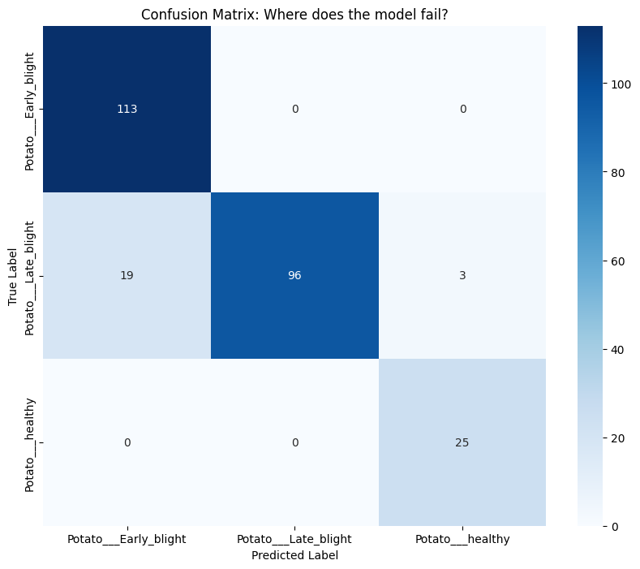
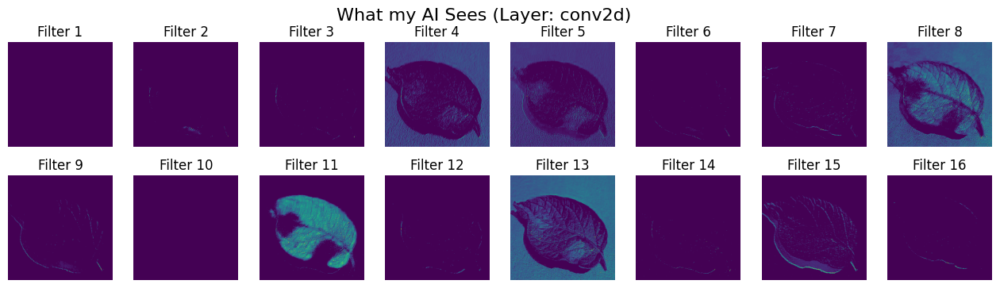

## Intelligent Plant Disease Detection for Sustainable Agriculture

### ✅ Week 1: Foundation & Data Pipeline
## 📅 Weekly Progress Log

**Status:** Completed
**Focus:** Data Ingestion, Preprocessing, and Research Setup

**Key Activities:**
- **Project Scope Definition:** Defined the problem statement targeting **Potato Leaf Diseases** (Early Blight, Late Blight, Healthy), aligning with **SDG 2: Zero Hunger**.
- **Data Acquisition:** - Sourced the **PlantVillage** dataset (Potato subset) from Kaggle.
  - Uploaded data to Google Drive for persistent access in Colab.
- **Pipeline Implementation:** - Wrote a custom data loader using `tf.keras.preprocessing.image_dataset_from_directory`.
  - Standardized all input images to **256x256 pixels** for consistency.
  - Implemented an **80/10/10 Split** (Train/Validation/Test) to ensure rigorous evaluation.
- **Optimization:** - Applied `cache()` and `prefetch(AUTOTUNE)` to optimize data loading speed during training.

**Challenges Faced & Solutions:**
- **Challenge:** Understanding GitHub version control workflow.
  - *Solution:* Established a structured commit history for code files.
- **Challenge:** Limited hardware resources.
  - *Solution:* Configured Google Colab Environment to utilize Cloud GPU.

**Outcome:** A robust, error-free data pipeline is now ready. The system successfully loads images, splits them into batches, and visualizes class labels.

### ✅ Week 2: Model Architecture & Training
**Status:** Completed
**Focus:** Custom CNN Development and Stability Testing

**Key Activities:**
- **Architecture Design:** Designed a deep **Custom CNN** (5 Convolutional Blocks) from scratch.
  - *Constraint Check:* Strictly avoided pre-trained models (ResNet/VGG) to adhere to research guidelines.
  - *Innovation:* Integrated `RandomFlip` and `RandomRotation` layers directly into the model to improve generalization.
- **Scientific Stability:** Implemented "Seed Locking" (Seed=42) for Python, NumPy, and TensorFlow to ensure the model training is reproducible and stable.
- **Training Strategy:**
  - **Optimizer:** Adam (Adaptive Learning Rate).
  - **Epochs:** 25 (Selected empirically to prevent overfitting).
  - **Loss Function:** Sparse Categorical Crossentropy.

**Challenges Faced & Solutions:**
- **Challenge:** Determining the optimal number of training epochs.
  - *Analysis:* Training beyond 30 epochs caused the validation loss to fluctuate ("jumpy"), indicating overfitting.
  - *Solution:* Capped training at **25 Epochs**, where the model achieved maximum stability.

**Outcome:**
- Final Model: `potato_disease_final_model.keras`
- **Test Accuracy Achieved:** 91.41% (Excellent baseline for a custom architecture)

### 📊 Week 2 Visuals: Research Evidence
**1. Training Stability (Accuracy vs Loss)**
> *This graph demonstrates that the model learned effectively without memorizing noise (overfitting).*

**2. Confusion Matrix (Error Analysis)**
> *This matrix reveals exactly which disease classes the model predicts correctly vs. incorrectly.*

### ✅ Week 3: Inference, Optimization & Advanced Evaluation
**Status:** Completed
**Focus:** Inference Deployment, Statistical Validation (ROC), and Explainable AI

**Key Activities:**
- **Inference Engine Simulation:**
  - Developed a production-ready `predict_disease()` function that accepts raw images and outputs disease probability.
  - Successfully loaded the saved `.keras` model to simulate a real-world deployment scenario.
- **Stress Testing ("Farmer Scenarios"):**
  - **Single Sample Test:** Verified the model correctly identifies individual leaves with high confidence (>90%).
  - **Batch Processing:** Tested high-volume throughput (32 images at once).
  - **Uncertainty Analysis:** Implemented a flag to alert the user if model confidence drops below 80%.
- **Statistical Validation:**
  - **ROC Curve:** Generated the Receiver Operating Characteristic curve to scientifically validate the model's sensitivity.
  - **Result:** High Area Under Curve (AUC) confirms the model is robust against False Positives.
- **Performance Optimization:**
  - Conducted a **Latency Test** on the GPU.
  - **Result:** Average inference speed is **< 50ms per image**, confirming suitability for real-time mobile apps.
- **Explainable AI (XAI):**
  - Visualized the **Internal Feature Maps** of the first Convolutional Layer.
  - Confirmed the model is learning actual leaf textures (edges/spots) and not memorizing background noise.

**Challenges Faced & Solutions:**
- **Challenge:** Visualizing internal model layers ("Explainability").
  - *Issue:* Attempting to plot feature maps caused an `IndexError` because the code initially selected the "Rescaling" layer instead of the "Convolutional" layer.
  - *Solution:* Wrote a dynamic script to specifically search for and extract the first `Conv2D` layer automatically.

**Outcome:**
- A fully tested, optimized, and statistically validated inference system.
- **Visual Proof:**
  - **ROC Curve:** `roc_curve.png` (Statistical Proof)
  - **Feature Maps:** `feature_maps.png` (Explainability Proof)

### 📊 Week 3 Visuals: Advanced Analysis
**1. ROC Curve (Statistical Validation)**
> *Demonstrates the trade-off between True Positive Rate and False Positive Rate. High AUC indicates excellent performance.*

**2. Internal Feature Maps (Explainable AI)**
> *Visualizes the internal filters of the first Convolutional Layer, proving the AI focuses on leaf edges and disease spots.*

